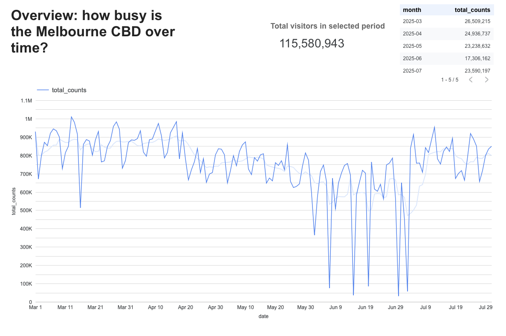

# Melbourne Foot-Traffic → Marketing & Analytics

An end-to-end, reproducible project that turns City of Melbourne pedestrian counts + weather + ABS demographics into a compact **marketing dashboard and playbook** for running a CBD pop-up (for example, a coffee cart).



---

## Live dashboard

**Looker Studio report**  
Melbourne Foot-Traffic: Pop-up Planning  
👉 Link: https://lookerstudio.google.com/reporting/d4bfbaa6-2b13-484c-b5a0-50711a5a6767

The report has four pages:

1. **Overview – how busy is the CBD over time?**  
   *Total visitors per day, trends by month, and the total foot-traffic in the selected period.*

2. **Peak times – when does the city get busy?**  
   *Heatmap of average visitors by weekday × hour, plus a daily distribution chart.*

3. **Rain & locations – where does rain help me most?**  
   *Which sensors and locations see extra visitors on rainy days vs dry days.*

4. **Map – CBD map where rain helps most**  
   *Circle size = visitors on rainy days (median/day).  
   Circle colour = % uplift on rainy vs dry days.*

Use this report as a planning tool when choosing **where** and **when** to run a small CBD pop-up.

---

## What this ships

This repository ships:

- A clean, notebook-driven data pipeline (Python, geo-friendly environment).
- A Looker Studio dashboard wired to exported CSVs.
- A small marketing kit:  
  - traffic story by time and place,  
  - spots where rain is actually helpful,  
  - simple language so a non-technical stakeholder can follow the story.
- A short compliance checklist (privacy, spam rules, basic advertising ethics).

---

## How the pipeline works

At a high level, the pipeline has four layers.

### 1. Raw data

Located under `data/` and `notebooks/data/`:

- City of Melbourne pedestrian counts for all sensors, all timestamps.
- Weather and rain flags.
- Any extra CSVs needed to join counts with sensor metadata.

These are the “source of truth” tables and are not edited by hand.

---

### 2. Processing in notebooks

Most of the work happens in the `notebooks/` folder.

Key notebooks:

- `01_download_com_FIXED.ipynb`  
  Downloads / refreshes core City of Melbourne counts and tidies the schema.

- `02_*.ipynb` (intermediate steps)  
  Merges, reshapes and joins counts with metadata and rain flags.

- `05_viz_export.ipynb`  
  Produces:
  - hourly counts by sensor and by day,
  - rain-uplift metrics by sensor,
  - clean sensor locations for mapping.

Interim tables live under `notebooks/data/interim/`, including:

- `hourly_counts_combined.csv`
- `sensor_locations_clean.geojson`

These are handy for debugging and for re-using outside the dashboard.

---

### 3. Exports for Looker Studio

Final, dashboard-ready CSVs live under:

```text
analytics/looker_studio_datasources/

---

## Quickstart

There are two main ways to run the project locally.
Option A – Conda environment (recommended for geo work)
# 1. Clone this repository
git clone https://github.com/RajPoo7/melbourne-foot-traffic-marketing.git
cd melbourne-foot-traffic-marketing

# 2. Create and activate the conda env
conda env create -f environment.yml
conda activate melb_foot_traffic
Option B – venv + pip
# 1. Clone this repository
git clone https://github.com/RajPoo7/melbourne-foot-traffic-marketing.git
cd melbourne-foot-traffic-marketing

# 2. Create and activate a virtual environment
python -m venv .venv
source .venv/bin/activate   # Windows: .venv\Scripts\activate

# 3. Install dependencies
pip install -r requirements.txt
